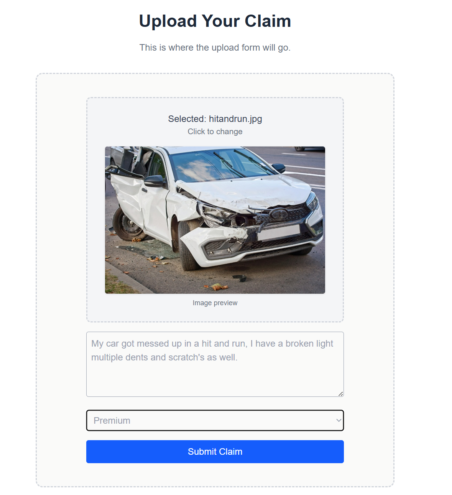
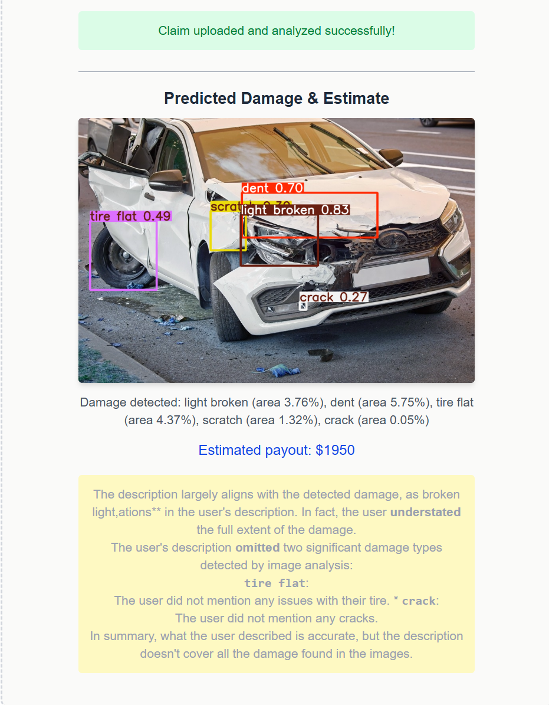

  

<h1 align="center">🚗 SighthoundAI</h1>

  <em>AI-powered claims assistant to streamline car insurance claims with computer vision.</em>

---

## 🌐 Live Demo

👉 [**Visit SighthoundAI Website**](https://sighthound-ai-v2.vercel.app/)

---

## ✨ Overview

**SighthoundAI** uses advanced machine learning to instantly analyze car crash images, classify damage, and generate preliminary claim estimates.

✅ **No paperwork. No phone trees. Just upload and go.**

---

## ⚡ Features

- **Real-Time Image Analysis**  
  Upload vehicle damage photos and automatically detect damage types.

- **Instant Claim Assessment**  
  Generate a claim estimate within seconds, accelerating resolution.

- **Fraud Detection (Optional)**  
  Analyze image metadata to flag potentially fraudulent submissions.

- **Seamless Integration**  
  Built end-to-end with Next.js, FastAPI, Supabase, and YOLOv8.

---

## 🛠️ Tech Stack

- **Frontend:** Next.js + Tailwind CSS
- **Backend:** FastAPI (Python)
- **Machine Learning:** YOLOv8 for computer vision damage detection
- **Database & Storage:** Supabase (PostgreSQL & Object Storage)
- **Deployment:** Vercel + Cloudrun

---

## 📷 How It Works

1. **Upload Image + Description**  
   Users drag and drop a photo and enter incident details.

2. **Damage Detection**  
   YOLOv8 model classifies damage types (dent, scratch, crack, etc.).

3. **Estimate Generation**  
   Calculates payouts based on damage severity and policy tier.

4. **Claim Submission**  
   Stores claim data securely in Supabase for review.

---

## 🖼️ Before & After

<table>
  <tr>
    <td align="center">
      
       <strong>Before</strong>
    </td>
    <td align="center">
      
       <strong>After</strong>
    </td>
  </tr>
</table>

---

## 📫 Contact

Feel free to reach out if you’d like to collaborate or learn more about this project!

---

